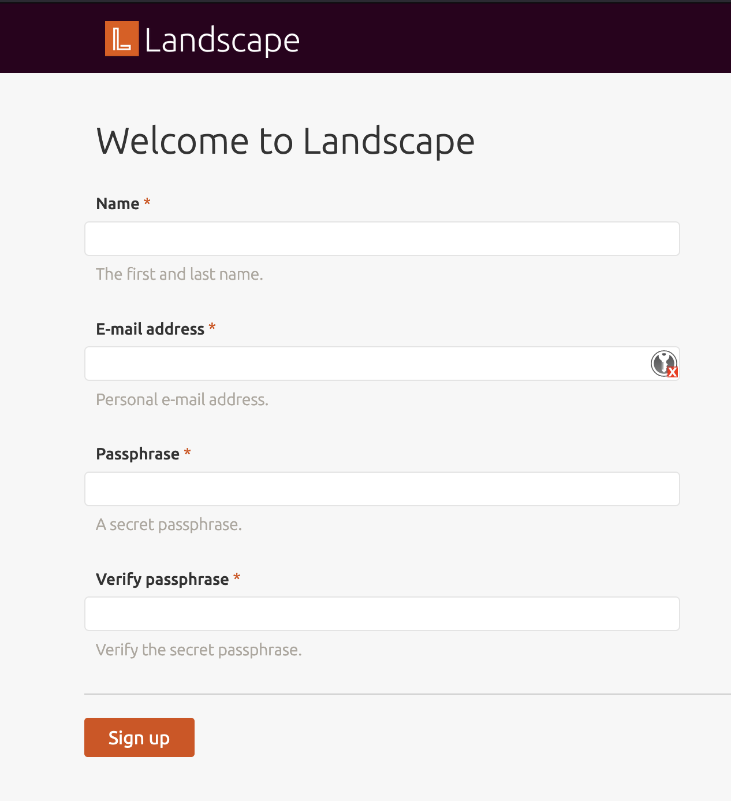

# Ubuntu Landscape

This repo stores an ITS Private Cloud CLI ``vss-cli`` specification to deploy 
a Landscape server running Ubuntu 22.04 on the ITS Private Cloud.

```
├── README.md
├── cloud-init
│   ├── network.yaml
│   └── userdata.yaml
├── deploy.sh
└── ubuntu-landscape-spec.yaml
```
## ITS Private Cloud ``cloud-init`` implementation

The ITS Private Cloud implementation of ``cloud-init`` is using the ``NoCloud`` datastore
to ensure wider compatibility accross multiple operating systems.

To deploy a VM and generate an iso seed, the ``vss-cli`` provides two methods:
- ``compute vm mk from-clib``: traditional options using ``--network-config`` and ``--user-data``. i.e [deploy_cli.sh](deploy_cli.sh)
- ``compute vm mk from-file``: ``vss-cli`` specification to deploy vms declaratively. i.e [deploy_spec.sh](deploy_spec.sh) and [spec](spec/ubuntu-landscape-spec.yaml)

## Virtual Machine specs

The virtual machine to deploy in both [deploy_spec.sh](deploy_spec.sh) and [deploy_cli.sh](deploy_cli.sh) has the following specs:
- 1x60 GiB Disk for the OS on `hdd`.
- 4GiB of Memory
- 2 vCPUs
- Secure Boot and UEFI.

All the above is defined in [spec](spec/ubuntu-landscape-spec.yaml).

## Cloud-Init

The `cloud-init` folder stores two main files: ``network.yaml`` and ``userdata.yaml``. The ``userdata.yaml`` holds the main configuration that will be applied to the Ubuntu OS upon deployment.

This example makes the following customizations to the OS:
- Install packages defined in ``packages`` section.
- Adds ITS Private Cloud MOTD showing VM name and ID.
- Enables `ssh` using a non-standard port ``2226``.
- Creates a firewall rule using ``firewalld`` to allow ``ssh`` connections on port ``2226``.
- Creates a firewall rule using ``firewalld`` to allow ``netatalk`` related ports.
- Disables IPv6.
- Sets ``/data/homes`` as base backup path.
- Moves ``/home`` to ``/data/homes`` and creates a symlink to ``/home``.

The following sections are recommended to update:
- ``hostname`` and ``fqdn`` 
-``users`` section with the list of users to allow access to the server, including `ssh-keys` and hashed passwords. The ``vss-cli misc hash-string`` command is recommended to generate hashed passwords.

## Requirements

- ITS Private Cloud cli aka vss-cli >= v2022.10.1.
- Target vCenter Folder.
- Target vCenter Network.

## Deployment

### ITS Private Cloud CLI ``vss-cli`` spec

1. Edit [spec](spec/ubuntu-landscape-spec.yaml) and update any settings that may apply to your Org unit, such as `folder`, `name`, `network` or any other item in the metadata section. Note that if you change the network to one that does not have DHCP enabled, ``cloud_init.network_data`` must be added
2. Edit [user-data](cloud-init/userdata.yaml) and update recommended settings mentioned in the [#Cloud-Init](#cloud-init) section.
3. (Optional) Edit [network-config](cloud-init/network.yaml) and update your networking settings based on the network selected in step 1 ([spec](spec/ubuntu-landscape-spec.yaml))
4. Run the following command or execute ``sh deploy_spec.sh``:
    ```
    vss-cli --wait compute vm mk from-file spec/ubuntu-landscape-spec.yaml
    ```
    **output:**
    ```
    id                  : 7749                
    status              : IN_PROGRESS         
    task_id             : 0d0c2dbb-fb11-4087-8954-c29682d895bd
    message             : Request has been accepted for processing
    ⏳ Waiting for request 7749 to complete... 
    🎉 Request 7749 completed successfully:
    warnings            : Ubuntu Pro Token attached., Domain: FD3 (domain-c5877), Created in: Public > ITS Cloud Demo (group-v13966), Network adapter 1 (vmxnet3): 00:50:56:92:d3:c3: VL-0253-EIS-VSS-CGN, Power on delayed. Waiting for cloud-init to be applied., Ubuntu Pro Token attached., Domain: FD3 (domain-c5877), Created in: Public > ITS Cloud Demo (group-v13966), Network adapter 1 (vmxnet3): 00:50:56:92:d3:c3: VL-0253-EIS-VSS-CGN, Power on delayed. Waiting for cloud-init to be applied., User data will be applied., Successfully allocated 00:50:56:92:d3:c3 -> 100.76.43.73
    errors              :  
    ```
### ITS Private Cloud CLI ``vss-cli``

1. Edit [user-data](cloud-init/userdata.yaml) and update recommended settings mentioned in the [#Cloud-Init](#cloud-init) section.
2. (Optional) Edit [network-config](cloud-init/network.yaml) and update your networking settings based on the network selected in step 1 ([spec](spec/ubuntu-landscape-spec.yaml))
3. Edit the following command or script  ``sh deploy_cli.sh`` and update any settings that may apply to your department or unit, such as `--folder`, `name`, `--net`. Note that if you change the network to one that does not have DHCP enabled, ``--network-config`` must be added:
    ```
    vss-cli --wait compute vm mk from-clib \
    --memory 4 --cpu 2 \
    --source Ubuntu-22.04 \
    --disk 60 --firmware efi \
    --description 'Ubuntu 22.04 server with Landscape.' \
    --client EIS --os ubuntu64Guest --usage Prod \
    --folder 'Your > Folder > Path' --net VSS-CGN \
    --extra-config disk.EnableUUID=TRUE \
    --user-data cloud-init/userdata.yaml \
    --vss-service N/A --power-on vss-ubuntu-landscape
    ```
    **output:**
    ```
    id                  : 7751                
    status              : IN_PROGRESS         
    task_id             : c2cb4fd5-8b02-4853-af9c-f008b4bf8fb6
    message             : Request has been accepted for processing
    ⏳ Waiting for request 7751 to complete... 
    🎉 Request 7751 completed successfully:
    warnings            : Ubuntu Pro Token attached., Domain: FD3 (domain-c5877), Created in: Public > ITS Cloud Demo > CLI > Ubuntu (group-v596082), Network adapter 1 (vmxnet3): 00:50:56:92:d7:c3: VL-0253-EIS-VSS-CGN, Power on delayed. Waiting for cloud-init to be applied., Ubuntu Pro Token attached., Domain: FD3 (domain-c5877), Created in: Public > ITS Cloud Demo > CLI > Ubuntu (group-v596082), Network adapter 1 (vmxnet3): 00:50:56:92:d7:c3: VL-0253-EIS-VSS-CGN, Power on delayed. Waiting for cloud-init to be applied., User data will be applied., Successfully allocated 00:50:56:92:d7:c3 -> 100.76.43.231
    errors              :   
    ```

## Use

Once the VM is deployed, you could access it via ``ssh`` on port ``2226`` and see the ``cloud-init`` log to verify everything is working fine.

### SSH

1. Open your terminal or PuTTY client and point to the IP address provided in the email, if either the ``VSS-CGN`` or ``VSS-PUBLIC`` network was selected. Otherwise, use the IP address predefined in [network.yaml](cloud-inint/network.yaml).
2. Use any of the defined users in the [userdata.yaml](cloud-init/userdata.yaml) file. 
3. Open a new session using port ``2226``:
    ```
    ssh -p 2226 vss-admin@X.X.X.X
    ssh -p 2226 vss-admin@X.X.X.X
    The authenticity of host '[X.X.X.X]:2226 ([X.X.X.X]:2226)' can't be established.
    ED25519 key fingerprint is SHA256:B45QaH0k.......+BA7ABtgx4.
    This key is not known by any other names
    Are you sure you want to continue connecting (yes/no/[fingerprint])? yes
    Warning: Permanently added '[X.X.X.X]:2226' (ED25519) to the list of known hosts.
    Welcome to Ubuntu 22.04.1 LTS (GNU/Linux 5.15.0-52-generic x86_64)

    University of Toronto ITS Private Cloud Instance

    Name:     2211T-landscape-server
    ID:       vm-000000

    System information as of Wed Nov  2 14:54:13 EDT 2022

    System load:    0.0              Processes:               163
    Usage of /: 8.5% of 57.97GB      Users logged in:         1
    Memory usage:   21%              IPv4 address for ens192: X.X.X.X
    Swap usage:     0%

    0 updates can be applied immediately.

    ```
4. Promote yourself as super user: ``sudo su``.
5. Inspect ``/var/log/cloud-init-output.log``.

### Ladscape Server)

#### Post Configuration

***For this example we will use the ip address: 100.76.43.73***

1. Edit /etc/hosts and assign the ip address of the current virtual machine.
    ```
    127.0.0.1 localhost
    100.76.43.73 landscape-server 
    ```
2. Open a browser with the following ip address: https://100.76.43.73
3. Click Advance... button and Accept the Risk and Continue button.
4. This will show the Landscape Setup
   
